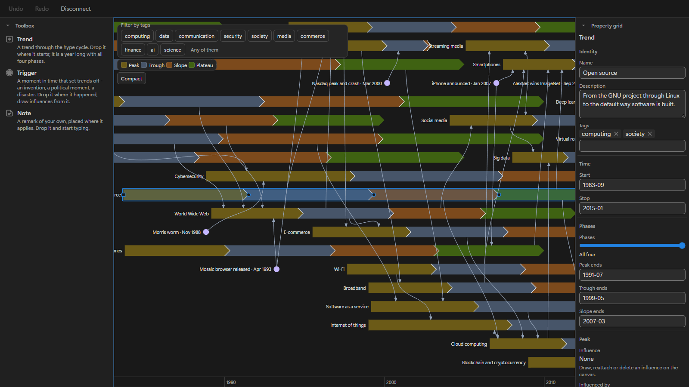

# etalii.adp.ide.notion

The ADP tools in Notion. A Notion add-on is a web page that shows one ADP tool inside a Notion page; this repository builds the add-ons and publishes them at <https://etalii.net/adp-notion>. There is one add-on, the Gartner hype cycle graph.

ADP, A Different Perspective, is a range of specialized tools: diagrams, designers and editors. The site is at <https://etalii.net/adp/>.

## The add-on

| Add-on | Address |
| --- | --- |
| Gartner hype cycle graph | `https://etalii.net/adp-notion/gartner-hype-cycle-graph/?store=<database id>` |

The Gartner hype cycle graph is a diagram of trends, the triggers that start them, notes, and the influences between them, drawn along time. In Notion the graph is a database: its rows are the graph, and the add-on, embedded in a Notion page, draws that database and writes what a user changes back to it. One published add-on serves any number of graphs; the `store` of the address says which database a page shows. Embedded without a `store`, the add-on lets the user choose a database, asks about the properties it gets, and makes the embed block name it. [docs/set-up-a-graph.md](docs/set-up-a-graph.md) gives the steps.

An add-on reaches Notion through a small service: a published page talks to the deployed one, a Cloudflare Worker, and a page served from `localhost` to the local one, with a real Notion database or with an in-memory one. [docs/service.md](docs/service.md) says how both are run. A person grants access once, from the page itself. That works in a web browser and in the Notion desktop app. The app opens the grant in the system's browser, so there the service hands the token to the add-on.

## Build and test

Node 24 or later is needed, and nothing else.

| Command | Does |
| --- | --- |
| `npm test` | Runs the tests: the interpreter, the store against an in-memory Notion, the history, the canvas, the panels, the page, the examples, and the two tests of the shared parts' own rules |
| `npm run lint` and `npm run typecheck` | Run the linter and the type check |
| `npm run build` | Writes the published tree to `dist/`: the add-on index and one folder per add-on. It is `node scripts/build.mjs --out dist`, the command the publication runs |
| `node scripts/service.mjs --memory` | Runs the local service at `http://localhost:8787` with an in-memory Notion, which needs no account |

To see the add-on working, build it, serve `dist/` at `http://localhost:8080`, run the local service, and open `http://localhost:8080/gartner-hype-cycle-graph/`, where the add-on lets you choose a database, or the same address with `?store=<database id>`. [docs/service.md](docs/service.md) says how the local service is run against Notion and against the in-memory one.

## Documents

| Document | Says |
| --- | --- |
| [docs/set-up-a-graph.md](docs/set-up-a-graph.md) | How a graph is set up in Notion: the database, the page that embeds the add-on, and filling a store from a file |
| [docs/service.md](docs/service.md) | The service between an add-on and Notion: what exists, its endpoints and secrets, and how it is run |
| [docs/disl-support.md](docs/disl-support.md) | What the shared parts read of a DISL specification, what they do not, and the known limits |
| [addons/README.md](addons/README.md) | What an add-on consists of and how a second one is made |

Every add-on is drawn and edited by the same shared parts under `src/`, which take everything about a tool type from its DISL specification and its FBL binding. Both are specified in [etalii.adp](https://github.com/etalii-adp/etalii.adp), where this repository's features are specified too.

## Licence

[Apache License 2.0](LICENSE).
